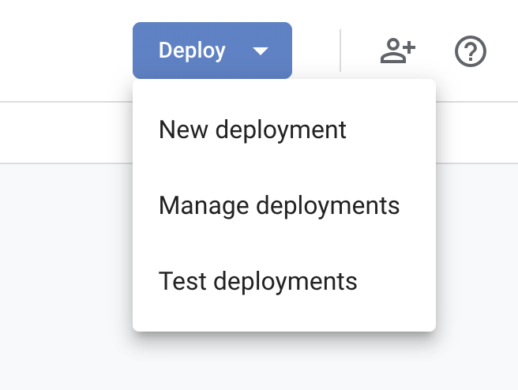
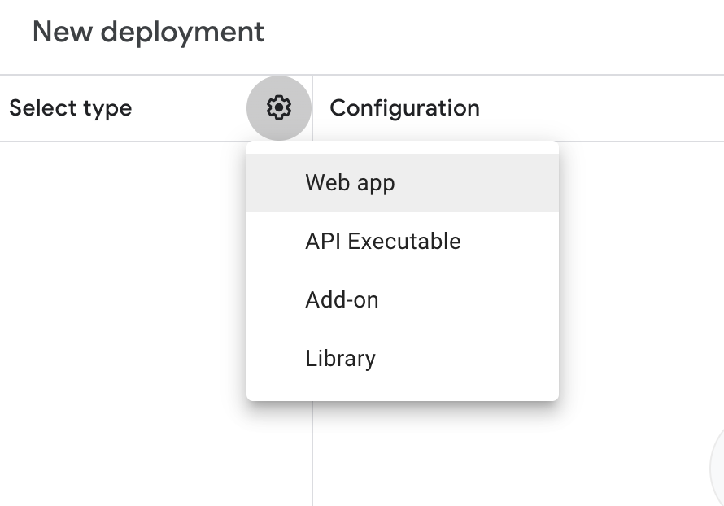
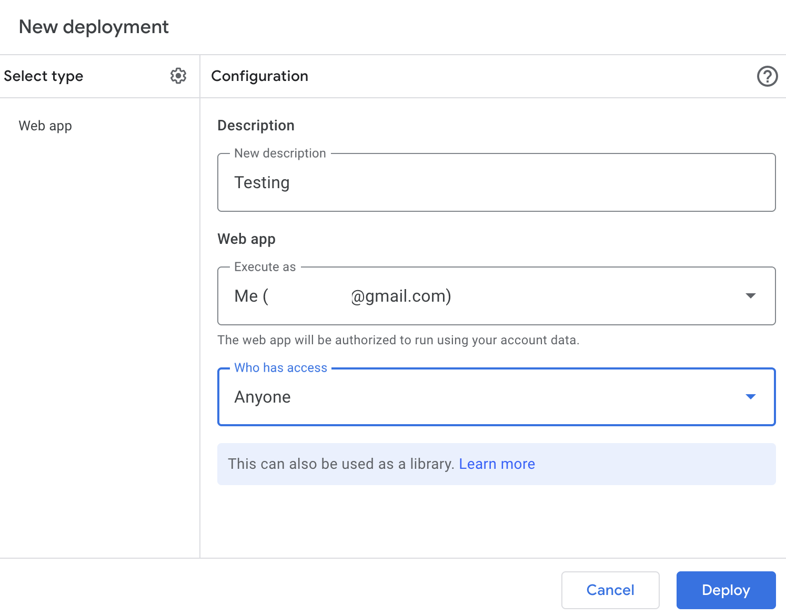
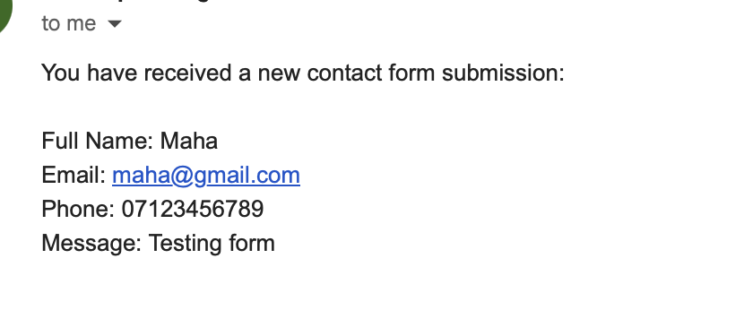

# AutoNotify – Serverless Form System

A lightweight, serverless solution for sending email notifications and logging form submissions to **Google Sheets** and **Gmail**, perfect for **small projects, MVPs, and portfolios**. Skip the heavy backend setup and focus on building faster. AutoNotify simplifies email integration with **Google Apps Script** & **Netlify Functions** — **no extra paid services required**.

---

## 🛠 Why I Built AutoNotify

A small, non-technical business came to me, they needed a simple way to collect enquiries and send email notifications. They didn’t want to manage a heavy backend, pay for third-party services like Formspree, or deal with complex setups.  

I built **AutoNotify**: a lightweight, serverless system that logs submissions to Google Sheets and sends emails via Gmail. It works with **Google Workspace**, so no extra cost for notifications. It’s perfect for **small projects, MVPs, and simple forms**, but **not intended for large-scale or high-traffic applications**.

---

## ⚡ Features

- Sends email notifications via Gmail (no extra paid service required)  
- Logs submissions in Google Sheets  
- Serverless & secure (API keys and backend hidden)  
- Plug & play: just add your Google Sheet ID & Script URL  
- Works for small businesses, freelancers, and MVPs  
- Simple form setup, no heavy backend required  

---

## 🎯 Use Cases

- Contact or quote forms for small businesses  
- Client intake forms for freelancers  
- Feedback or FAQ submission forms on websites  
- Beta signups and pre-launch interest  
- Developers experimenting with serverless & Google Apps Script  
- Anyone wanting lightweight, no-cost email notifications using Google Workspace  

---

## 🚀 Getting Started (Play & Plug)
1. **Create a Google Sheet** and name a tab `FormResponses`.  

2. **Create a Google Apps Script** attached to the Sheet with the `doPost` function.

3. Google App Script is in the **GoogleAppScript.md**

4. Deploy Google Script as a web app and copy the URL.

5. Set the Script URL in your Netlify environment variable GOOGLE_SCRIPT_URL.

6. Netlify function submit-quote.js will forward form submissions securely to Google Script.

- 
- 
- 

---

## 📂 Project Structure

- index.html
- style.css
- script.js
- 📁 netlify/📁functions/submit-quote.js
- README.md
- GoogleAppScript.md
- 📁 LICENSE/LICENSE.md

---

## 👨‍💻 How to Use

- Open index.html and update the form if needed.
- Add your Google Sheet ID, Email in your script and Script URL in netlify Environment Variables.
- Deploy to Netlify to test the system live.
Enjoy a plug & play email + spreadsheet notification system!

---

## 📌 NOTE for the Google script:

You need to replace the your_sheet_id placeholder with your actual Google Sheet ID in the code. For example:

- const sheet = SpreadsheetApp.openById("your_sheet_id");

### How to find your Google Sheet ID

1. Copy your Google Sheet URL. It will look something like this: 
https://docs.google.com/spreadsheets/d/2b5ADl2wBMhfIKiujWtCD6X66nzOF-LdRff2LkMyAbGc/edit?gid=0#gid=0

2. The Sheet ID is the part between /d/ and /edit.
- 👉 In this example, the ID is:
**2b5ADl2wBMhfIKiujWtCD6X66nzOF-LdRff2LkMyAbGc**

3. Copy that ID and paste it into your script where your_sheet_id is. For example:

- const sheet = SpreadsheetApp.openById("2b5ADl2wBMhfIKiujWtCD6X66nzOF-LdRff2LkMyAbGc");

---

## 📹 Demo / Screen Recording

See it in action:
- [Demo Video](https://www.capcut.com/sv2/ZS98ycvy668GE-51NHA/)

---

## 📝 Note: 

For your own testing, just replace the Google Sheet ID and Script URL. Everything is safe and ready to experiment with, perfect for developers or small business owners who want a working prototype immediately.

---

## 📂 Play & Plug Notes

- Developers can copy the code and immediately plug in their Google Sheet & Script URL.
- Safe for experimentation — no sensitive data in repo.
Designed for small businesses & MVPs, not for enterprise or high-volume systems.
- Google Workspace users: you can use your existing account for free notifications, no extra cost.

---

## 📝 License

This project is licensed under the **MIT License** – see [LICENSE](./LICENSE) for details.